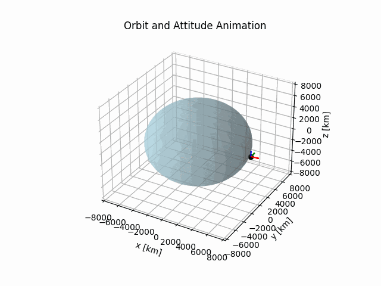

# Attitude control systems

A repository of algorithms exploring the use of **control systems applied to attitude control** in spacecrafts.

The following algorithms are available:
- [Attitude control PID](./attitude_control_pid)

## Attitude control PID 

An **object-oriented programming (OOP) code for attitude control of an spacecraft** in low orbit arround a celestial body. It offers a model for orbital and attitude dynamics, attitude control and simulation.

### ⚙️ Features

- **Orbital dynamics**: simplified orbit propagation (2-body problem) and reference vectors generation.
- **Attitude dynamics**: rotational dynamics with Runge-Kutta 4th order (RK4) numerical integration.
- **Attitude control**: digital proportional-integral-derivative (PID) controller.
- **Animation and analysis**: 3D animation of orbital and attitude moviment. 
- **Software structure**: object-oriented architeture with independent classes and configuration file.

### 🎞️ Animation

- **Orbit and attitude animation**:

- **Attitude errors**:
  

  
  

- **References and output angles**:
  

  
  

This algorithm offers a simplified and modular version of the problem, heavily inspired by **Spacecraft-Attitude-Control-System** in

https://github.com/brunopinto900/Spacecraft-Attitude-Control-System
